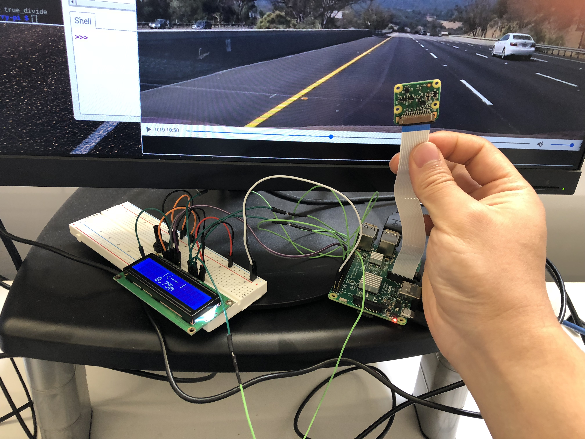

# Lane Watcher

This tool is an integration of original lane detection from uvbakutan/lane-detection-raspberry-pi and a LCD screen, so that this little gadget can be mounted in my wife's car and let her know how bad or bad ass she's driving.

## Before you start

Make sure you have the following:
1. Raspberry Pi, mine is RP3
1. [A picamera](https://www.amazon.com/Raspberry-Pi-Camera-Module-Megapixel/dp/B01ER2SKFS)
1. A 16*2 LCD screen, try [this](https://www.adafruit.com/product/181)
1. a breadboard and some wires
1. 10k Ohm Potentiometer

I don't have screen's i2c board, so the wiring part is a little messy.

## Wiring

1. follow [this article](https://pimylifeup.com/raspberry-pi-lcd-16x2/) to have the screen wired to your RP
1. mount the picamera to RP

## Software

1. build and install opencv3

    make sure you follow this [guide](https://www.pyimagesearch.com/2017/09/04/raspbian-stretch-install-opencv-3-python-on-your-raspberry-pi/)'s python3 part, and it is going to take about 2h
1. `pip install picamera numpy RPi.GPIO Adafruit_CharLCD`
1. `git clone https://github.com/putcn/lane-detection-raspberry-pi`
1. `python lane_watcher.py`

Now you are supposed to see the offset and direction in the LCD, or "Not Detected" message if the cam can't see any lane.

You can use sample_video.mp4 in this repo to test the program without truly driving on an open street.

## What next

### cam stand

make sure you have a stand for you cam in the car, since the tape connecting the cam and RP is very weak.

### autostart

Since we are not going to have keyboard or mouse in a car, this tool need to start along with the system.

There are several ways of doing so, just search it and we will not cover this part in this repo.

### ventilate for RP

vision related processing is very computation intensive, especially the real time ones like in our case, so RP's chips can get very hot running the lane detecting program. And the fact putting it in the car will just make the case worse. Make sure your RP has heat sink and/or good ventilation and don't fry your Pi :)

## Disclaimer

This tool is only for demonstration purpose. Don't use it in real world driving situation. Your eyes should be focusing on the road all the time when driving.